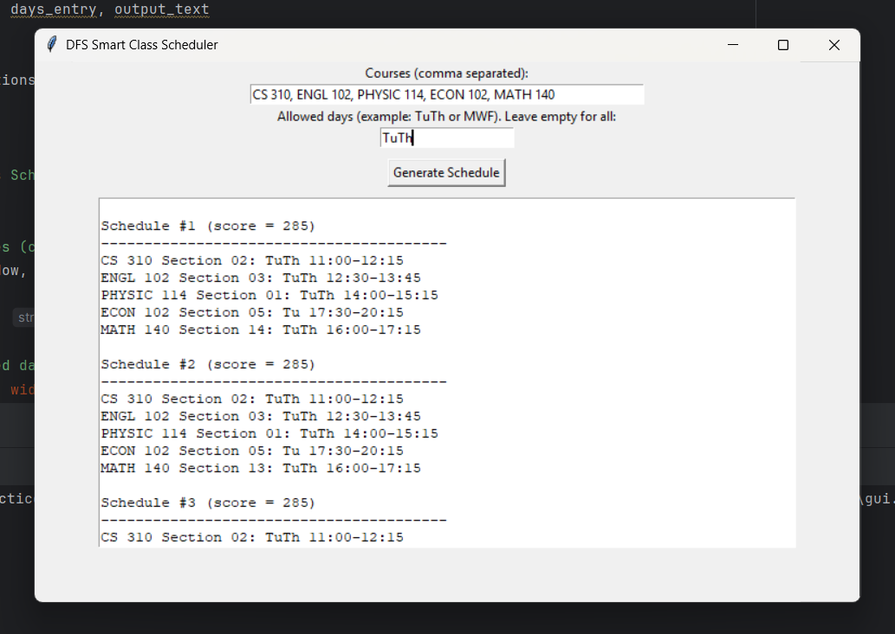

# DFS Smart Class Scheduler for UMass Boston

### Automated Course Scheduling Using Web Scraping & Algorithmic Optimization
#### Technologies:
- Python
- Selenium
- DFS
- Greedy Optimization
- Data Structures
#### Domain:
- Automation
- Algorithms
- Systems Design

### Overview:
The DFS Smart Class Scheduler is an automated scheduling system that helps students build optimal course schedules for an upcoming semester using real course offerings from the UMass Boston undergraduate catalog.

The program prompts users to:
* Select the courses they plan to take
* Specify which days of the week they are willing to attend classes

Using this input, the system systematically explores all valid combinations of class sections and returns the best possible schedules, ranked from best to worst, based on:
* Minimum idle time (fewer gaps between classes)
* Fewer days on campus
* Zero time conflicts

To achieve this, the scheduler combines a Depth-First Search (DFS) algorithm for exhaustive and optimized schedule generation with a greedy scoring heuristic that evaluates and ranks schedules by overall quality.

DFS is used to traverse the scheduling decision tree efficiently, pruning invalid paths early when time conflicts are detected. Once valid schedules are found, a greedy optimization function scores each schedule and prioritizes those with compact layouts and minimal class days, reflecting real student preferences.

This project demonstrates the application of algorithmic problem solving, search optimization, and constraint-based decision making in a real-world academic planning scenario, supported by a fully automated web-scraping data pipeline.

### Key Features in the Project:
- Built a full **data pipeline**: Web -> Structured Data -> Optimized Output
- Designed a **DFS-based combinatorial search** with pruning for efficiency
- Implemented **time-conflict detection** and **constraint filtering**
- Applied a **greedy scoring algorithm** to rank schedules by quality
- Engineered clean, modular Python code with seperation concerns
- Handled real-world edge cases (TBA times, missing data, interruption)

### Web Scraping & Data Normalization
- Uses **Selenium WebDriver** to scrape live UMass Boston data
- Extracts subjects, courses, semesters, and section meeting times
- Converts human-readable schedules into **machine-friendly formats**
- Outputs a clean CSV compatible with the scheduling engine

### Algorithms & Data Strcutures
- **Depth-First Search (DFS):** Explores all valid combinations of course sections, Backtracks on conflicts for efficient pruning & Guarantees optimal solutions within constraints.
- **Greedy Schedule Scoring:** Schedules are ranked using a heuristic, where +1 point per minute of idle gap & +60 points per disntinct class day. **Lower score = better schedules**.
- **Conflict Detection:** Detect overlaps by comparing shared meeting days & intersecting time intervals

## Interactive GUI

In addition to the command-line interface, this project includes a beginner-friendly
interactive graphical user interface (GUI) built using **Tkinter**.

The GUI allows users to:
- Enter desired courses for the upcoming semester
- Specify allowed class days (optional)
- Generate and view ranked, conflict-free schedules visually
- Interact with the scheduling algorithm without using the terminal

The GUI reuses the same DFS scheduling and conflict-detection logic as the CLI,
demonstrating a clean separation between **user interface** and **algorithmic logic**.

## GUI Screenshots

